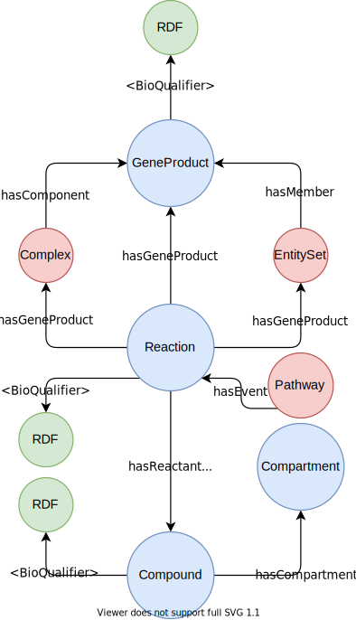

.. metabolike documentation master file, created by
   sphinx-quickstart on Wed Nov 10 10:23:25 2021.
   You can adapt this file completely to your liking, but it should at least
   contain the root `toctree` directive.

Welcome to metabolike's documentation!
======================================

The MetaCyc (BioCyc) database is imported to a graph database using the provided SBML file.

.. toctree::
   :maxdepth: 2
   :caption: Contents:

.. include:: ../README.rst

Indices and tables
==================

* :ref:`genindex`
* :ref:`modindex`
* :ref:`search`
