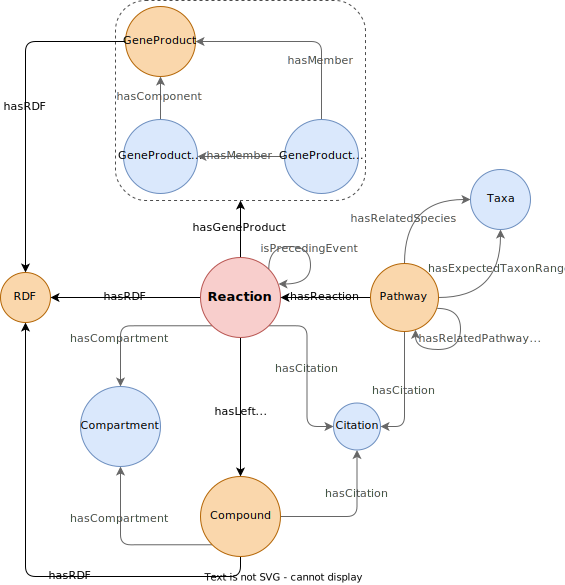

.. metabolike documentation master file, created by
   sphinx-quickstart on Wed Nov 10 10:23:25 2021.
   You can adapt this file completely to your liking, but it should at least
   contain the root `toctree` directive.
Metabolic reprogramming Knowledgebase
=====================================

This package aggregates the data from BRENDA_ and BioCyc_ into one unified `graph database`_ with the aim of studying reprogrammed metabolisms.

.. _BRENDA: https://brenda-enzymes.org/
.. _BioCyc: https://biocyc.org/
.. _graph database: https://neo4j.com/

.. toctree::
   :maxdepth: 2
   :caption: Usage

   usage/installation
   usage/getting_started

Indices and tables
==================

* :ref:`genindex`
* :ref:`modindex`
* :ref:`search`
