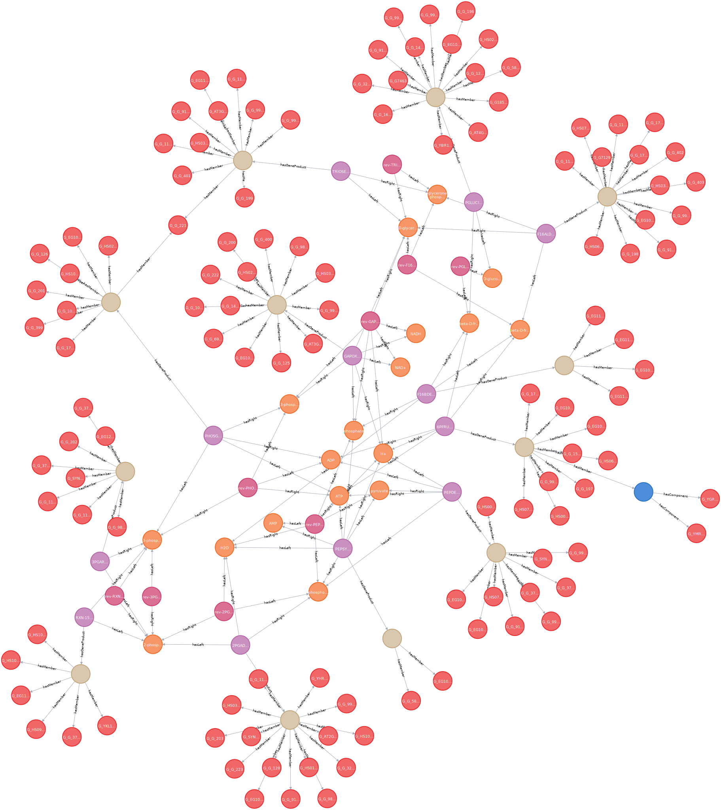

# Getting started

## Prerequisites

In this section, you will make use of the parser module of metabolike.
More specifically, you will use the [`SBML parser module`][parser.sbml] to extract information from an SBML model file and populate the graph database.
But before that, you will need to set up Neo4j and download a sample SBML file.

### Neo4j database

Since the main function of this package is to convert metabolic networks from text files to graphs, a running [Neo4j database](https://neo4j.com/product/neo4j-graph-database/) instance is needed as your storage backend.
You also need login credentials of a user with **write access** to the database.

If you prefer a managed cloud database, the official [Neo4j AuraDB](https://neo4j.com/cloud/platform/aura-graph-database/) is a good resource.
Once you set up an account with them, follow the onboarding process and create an **empty** database instance.
You will be prompted with a username and default password.
After a few minutes, the new instance will be created and you will get a connection URI in the form of `neo4j+s://<id>.databases.neo4j.io`.
Keep track of these three values as you will need them soon!
You may now jump to the [SBML model files](#sbml-model-files) section.

#### Using Docker

!!! tip

    This assumes Docker is already up and running on your machine.
    If not, no worries! [Installation of Docker](https://docs.docker.com/engine/install/) is a one-liner on most systems.
    More specific configurations could take a _lot_ longer, but I digress.

The other way to go is to set up your own Neo4j database.
Installation of Neo4j is explained in great detail on the [official documentation website](https://neo4j.com/docs/operations-manual/current/installation/).
For simplicity, this tutorial will focus on the Docker setup.

The Neo4j team maintains [an official image on DockerHub](https://hub.docker.com/_/neo4j) and has [great docs about its usage](https://neo4j.com/docs/operations-manual/current/docker/introduction/).
The following is sufficient to spin up a Neo4j instance listening on [localhost:7474](http://localhost:7474):

```bash
docker run \
    --restart always \
    -p=7474:7474 \
    -p=7687:7687 \ # (1)
    neo4j:4.4.9 # (2)
```

1. Port `7687` is used by the Bolt protocol.
   Check [the manual](https://neo4j.com/docs/operations-manual/current/configuration/ports/) or all ports relevant to Neo4j.
2. If you have an enterprise license, use `neo4j:4.4.9-enterprise` instead.

You most likely want to persist data across restarts, so Docker volumes should also be added:

```bash hl_lines="5 6"
docker run \
    --restart always \
    -p=7474:7474 \
    -p=7687:7687 \
    -v /path/to/data:/data \
    -v /path/to/logs:/logs \ # (1)
    neo4j:4.4.9
```

1. The mounted directories `/path/to/[data|logs]` should exist **before** running Docker, otherwise you'll either run
   into permission errors or have files created instead of directories.

The metabolike package requires the [APOC library](https://neo4j.com/labs/apoc/4.3/installation/) for complex queries.
You will have to download the binary `jar` file from [their release page](http://github.com/neo4j-contrib/neo4j-apoc-procedures/releases/) and place it in a directory (say `plugins/`).
For Neo4j 4.4.9, the APOC file you need is `apoc-4.3.0.9-all.jar`.
When this directory is mounted, the Neo4j image automatically recognizes and loads the plugin:

```bash hl_lines="7"
docker run \
    --restart always \
    -p=7474:7474 \
    -p=7687:7687 \
    -v /path/to/data:/data \
    -v /path/to/logs:/logs \
    -v /path/to/plugins:/plugins \
    neo4j:4.4.9
```

#### Using Docker Compose

If you happen to have [Docker Compose](https://docs.docker.com/compose/) installed, grab the following file:

```yaml title="docker-compose.yaml"
version: "3"

services:
  neo4j:
    image: "neo4j:4.4.9"
    container_name: neo4j-metabolike
    restart: unless-stopped
    ports:
      - 7474:7474
      - 7687:7687
    volumes:
      - neo4j-data:/data
      - neo4j-logs:/logs
      - "${PWD}/plugins:/plugins" # (1)
    environment: # (2)
      - NEO4J_apoc_export_file_enabled=true
      - NEO4J_apoc_import_file_enabled=true
      - NEO4J_apoc_import_file_use__neo4j__config=false
      - NEO4J_dbms_allow__upgrade=true
      - NEO4J_dbms_security_procedures_unrestricted=gds.*,apoc.*
      - NEO4J_dbms_security_procedures_allowlist=gds.*,apoc.*
      - NEO4J_ACCEPT_LICENSE_AGREEMENT=yes # (3)
    env_file:
      - .env # (4)

volumes:
  neo4j-data:
  neo4j-logs:
```

1. You should have a `plugins/` directory alongside `docker-compose.yaml`, and `apoc-4.3.0.9-all.jar` in the directory.
2. The environment variables are required by APOC in some cases.
3. Include this line if you are using the enterprise licensed version.
4. You can pass additional environment variables in a `.env` file in the same directory.

Inside the directory with the YAML file, run:

```bash
docker compose up -d
```

Now you can head to [localhost:7474](http://localhost:7474) and login using the default username and password.
You may be prompted to change the password after the first successful connection.

??? info "Default credentials"

    By default, the initial values for both the username and password are `neo4j`.
    You can override this by providing an environment variable `NEO4J_AUTH=neo4j/your-password`.
    You can also set `NEO4J_AUTH=none` and disable authentication for local debugging purposes.

### SBML model files

Here are two metabolic models of drastically different sizes for you to test out the capabilities of `metabolike`:

- A [small model](https://github.com/y1zhou/metabolike/blob/main/tests/data/metabolic-reactions.sbml?raw=true) containing the glycolysis pathway. This is also the model metabolike uses for internal tests.
- The [Human-GEM](https://github.com/SysBioChalmers/Human-GEM/blob/main/model/Human-GEM.xml?raw=true) model, where `GEM` stands for genome-scale metabolic model.

You may download either file (or bring your own SBML model of interest) and save it to a local directory. In later sections, we will be using the small model for demonstration purposes.

## Metabolic graph setup

To let metabolike parse the SBML model and transform it to a graph, the easiest way is to use the provided CLI tool.
If you have followed [installation instructions](./installation.md), try running the following command and see if you get the same help message:

```shell-session
$ metabolike setup --help
Usage: metabolike setup [OPTIONS]

Options:
  -c, --config TEXT             Path to the configuration file.  [required]
  --create-db / --no-create-db  When database creation is not allowed, set
                                this to False.  [default: create-db]
  -f, --drop-if-exists          Drop the database if it already exists.
  --help                        Show this message and exit.
```

??? info "What are these options?"
In some restricted environments (e.g. Neo4j AuraDB), the user may not have database creation privileges.
The `--no-create-db` option is provided so that you can manually create the database and skip the metabolike procedure.
The `-f` flag is for overriding existing databases. Handy for debugging, but be _very careful_ with it in production environments.

As the `-c` option suggests, a config file needs to be created. Use your favorite text editor and edit the following template:

```yaml title="metabolike-setup.yaml"
neo4j:
  uri: "neo4j://localhost:7687"
  user: neo4j
  password: <my-fancy-long-password>
  database: neo4j

metacyc:
  sbml: /path/to/model.sbml
```

> TODO: explain the `uri` field.

Change the password to your actual password, and the file path to wherever you've stored the SBML model downloaded earlier.
The following command will then parse the SBML model and feed it into the Neo4j graph database (it should take no more than a few seconds):

```shell-session
$ metabolike setup -c metabolike-setup.yaml
[INFO] 2022-11-12 21:32:55,371 - metabolike.config:57:load_config - Parsing config file metabolike-setup.yaml
[INFO] 2022-11-12 21:32:55,372 - metabolike.main:34:setup - Connecting to neo4j database
[INFO] 2022-11-12 21:32:55,766 - metabolike.parser.sbml:53:__init__ - SBML file: /y1zhou/metabolike/tests/data/metabolic-reactions.sbml
[INFO] 2022-11-12 21:32:55,767 - metabolike.parser.metacyc:77:__init__ - Input files: {'reactions': None, 'atom_mapping': None, 'pathways': None, 'compounds': None, 'publications': None, 'classes': None}
[INFO] 2022-11-12 21:32:55,767 - metabolike.main:44:setup - Setting up database using <class 'metabolike.parser.metacyc.MetacycParser'>
[INFO] 2022-11-12 21:32:55,791 - metabolike.parser.sbml:59:read_sbml - Finished reading SBML file
[INFO] 2022-11-12 21:32:55,833 - metabolike.db.sbml:249:create_nodes - Creating Compartment nodes
[INFO] 2022-11-12 21:32:55,861 - metabolike.db.sbml:263:create_nodes - Created 33 Compartment nodes
Compounds: 100%|█████████████████████████████████████████████████| 45/45 [00:00<00:00, 29390.17it/s]
[INFO] 2022-11-12 21:32:55,947 - metabolike.db.sbml:249:create_nodes - Creating Compound nodes
[INFO] 2022-11-12 21:32:56,005 - metabolike.db.sbml:263:create_nodes - Created 18 Compound nodes
Reactions: 100%|█████████████████████████████████████████████████| 12/12 [00:00<00:00, 26958.57it/s]
[INFO] 2022-11-12 21:32:56,039 - metabolike.db.sbml:249:create_nodes - Creating Reaction nodes
Reaction: 1it [00:00, 10.62it/s]
[INFO] 2022-11-12 21:32:56,134 - metabolike.db.sbml:263:create_nodes - Created 12 Reaction nodes
GeneProducts: 100%|████████████████████████████████████████████| 118/118 [00:00<00:00, 29507.42it/s]
[INFO] 2022-11-12 21:32:56,160 - metabolike.db.sbml:249:create_nodes - Creating GeneProduct nodes
[INFO] 2022-11-12 21:32:56,202 - metabolike.db.sbml:263:create_nodes - Created 117 GeneProduct nodes
Associated GeneProduct: 100%|█████████████████████████████████████| 12/12 [00:00<00:00, 9599.78it/s]
[INFO] 2022-11-12 21:32:56,240 - metabolike.db.sbml:249:create_nodes - Creating GeneProductComplex nodes
[INFO] 2022-11-12 21:32:56,284 - metabolike.db.sbml:263:create_nodes - Created 1 GeneProductComplex nodes
[INFO] 2022-11-12 21:32:56,317 - metabolike.db.sbml:249:create_nodes - Creating GeneProductSet nodes
[INFO] 2022-11-12 21:32:56,350 - metabolike.db.sbml:263:create_nodes - Created 12 GeneProductSet nodes
[INFO] 2022-11-12 21:32:56,350 - metabolike.db.sbml:249:create_nodes - Creating Reaction-GeneProduct nodes
[INFO] 2022-11-12 21:32:56,382 - metabolike.db.sbml:263:create_nodes - Created 12 Reaction-GeneProduct nodes
[INFO] 2022-11-12 21:32:56,415 - metabolike.db.sbml:249:create_nodes - Creating ReverseReaction nodes
ReverseReaction: 1it [00:00, 20.91it/s]
[INFO] 2022-11-12 21:32:56,463 - metabolike.db.sbml:263:create_nodes - Created 9 ReverseReaction nodes
[WARNING] 2022-11-12 21:32:56,464 - metabolike.db.sbml:340:_groups_to_graph - No groups plugin found in SBML file.
[WARNING] 2022-11-12 21:32:56,468 - metabolike.db.metacyc:177:_reactions_dat_to_graph - No reactions.dat file given
[WARNING] 2022-11-12 21:32:56,468 - metabolike.db.metacyc:274:_smiles_dat_to_graph - No atom-mappings-smiles.dat file given
[WARNING] 2022-11-12 21:32:56,468 - metabolike.db.metacyc:291:_compounds_dat_to_graph - No compounds.dat file given
[WARNING] 2022-11-12 21:32:56,468 - metabolike.db.metacyc:311:_citations_dat_to_graph - No pubs.dat file given
[WARNING] 2022-11-12 21:32:56,468 - metabolike.db.metacyc:327:_classes_dat_to_graph - No classes.dat file given
```

Congratulations! You've successfully imported your first SBML model into the graph database.
If you'd like a visual check, head to [localhost:7474](http://localhost:7474) and type in the following query:

```cypher
MATCH (n) WHERE NOT (n:Compartment OR n:RDF) RETURN n LIMIT 500;
```

If you were also using the sample glycolysis model, the returned graph should look somewhat like the one presented below.
Here the orange nodes are metabolites/compounds, purple nodes are reactions, red nodes are gene products (enzymes), and the other nodes are sets/complexes of gene products.


